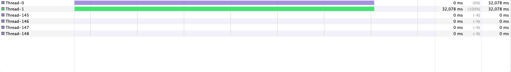
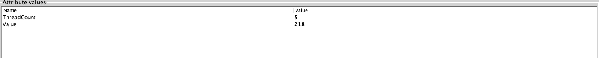

### 1. Time Sleep, Thread Count, Value 값에 경우 아래 메소드를 통해 실시간으로 변경했습니다.

```
public void changeVariable() {
		while (true) {
			Scanner scanner = new Scanner(System.in);
			int option = scanner.nextInt();

			switch (option) {
				case 1 -> setThreadSleepTimeLimit(scanner.nextInt());
				case 2 -> setThreadCountLimit(scanner.nextInt());
				case 3 -> setIncrementValueLimit(scanner.nextInt());
				default -> System.out.println("존재하지 않는 옵션입니다.");
			}
		}
	}
```

### 2. 모니터링 도구에 경우 visualVM을 사용했습니다.
#### 아래 예시는 time sleep만 실시간으로 변경한 경우입니다. (3000ms -> 15,000ms)


### 3. Thread Count, Value 값에 경우 MBean을 등록하여 확인했습니다.

실시간으로 값이 변하진 않았고, Refresh 버튼을 통해서 변한 값을 확인할 수 있었습니다.
Prometheus + Grafana + JMX Exporter를 통해서 실시간으로 확인할 수 있는지 다시 한번 해볼 계획입니다.